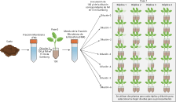
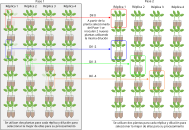

# Capítulo 4: Deriva

El objetivo de este capítulo es la corroboración experimental del efecto de la deriva ecológica sobre el microbioma rizosférico. A partir de 3 comunidades bacterianas se generaron sies trayectorias independientes, con distinta cantidad de inóculo bacteriano. Empleando estas trayectorias se realizó un experimento sobre plantas de tomate, obteniendo en cada pase el microbioma rizosférico detomate que servirá de inóculo para el siguiente pase.  

**Comienzo del experimento**

  

**Experimento de pases**

  

## Procesamiento Previo

Las secuencias procedentes de Illumina se sometieron a un tratamiento previo consistente en la eliminación de los cebadores y un procesado siguiendo el Pipeline de DADA2. Los scripts para realizarlo se encuentran en: [Procesamiento inicial](../Scripts%20Comunes/Procesamiento%20inicial/)

El objeto resultante de este procesado se encuentra en la sección de [Releases](https://github.com/rubenchaboy/Tomato-Assembly/releases/tag/Deriva) de este repositorio.

## Contenidos

- metadata_Deriva: el archivos excell con los datos correspondientes.
- `Analisis Deriva.Rmd`/` Analisis Deriva.html`: el script tanto en formato _.Rmd_ como _.html_ con el código utilizado para desarrollar los análisis de este capítulo.
  
## Funciones

### Análisis de diversidad y correlaciones

- Se representan los valores de las variables de trabajo (Carga, Peso, Riqueza, Homogeneidad y Diversidad) en función de Dilución y Pase.
- Se analizan estadísticamente los efectos de Dilución y Pase sobre las variables de trabajo.
- Se analizan estadísticamente los efectos de Riqueza y Diversidad sobre Carga y Peso.

### Análisis filogenético

- Se calculan las 10 familias más abundantes.

 ### Análisis de la composición

- Representación de la composición microbiana mediante el método NMDS utilizando distancias Bray-Curtis, separando los datos por Dilución y Tiempo, y agrupándolos visualmente según estas variables.
- Análisis de redundancia basado en distancias (dbRDA con Bray–Curtis) en su versión parcial, modelando la composición de las muestras en función de Pase mientras se controla el efecto de Dilución y también modelando la composición de las muestras en función de Dilución mientras se controla por Pase.
- Representación de la composición microbiana mediante el método NMDS utilizando distancias Unifrac, separando los datos por Dilución y Pase, y agrupándolos visualmente según estas variables.
- Análisis de redundancia basado en distancias (dbRDA con Unifrac) en su versión parcial, modelando la composición de las muestras en función de Pase mientras se controla el efecto de Dilución y también modelando la composición de las muestras en función de Dilución mientras se controla por Pase.
