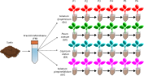
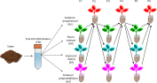

# Capítulo 5: Transmisión

El objetivo de este capítulo es Validar en la rizosfera las observaciones de Meyer y colaboradores en la filosfera (Meyer et al. 2023) respecto de cómo el modo de transmisión de los microbiomas afecta a su ensamblaje.

**Transmisión conespecífica**

  

**Transmisión heteroespecífica**

  

## Procesamiento Previo

Las secuencias procedentes de Illumina se sometieron a un tratamiento previo consistente en la eliminación de los cebadores y un procesado siguiendo el Pipeline de DADA2. Los scripts para realizarlo se encuentran en: [Procesamiento inicial](../Scripts%20Comunes/Procesamiento%20inicial/)

El objeto resultante de este procesado se encuentra en la sección de [Releases](https://github.com/rubenchaboy/Tomato-Assembly/releases/tag/Transmision) de este repositorio.

## Contenidos

- metadata_Transmision: el archivos excell con los datos correspondientes.
- `Analisis Transmision.Rmd`/` Analisis Transmision.html`: el script tanto en formato _.Rmd_ como _.html_ con el código utilizado para desarrollar los análisis de este capítulo.
- `Analisis ASVs.Rmd`/` Analisis ASVs.html`:  el script tanto en formato _.Rmd_ como _.html_ con el código utilizado para desarrollar los análisis de este capítulo

## Funciones  Analisis Transmision
