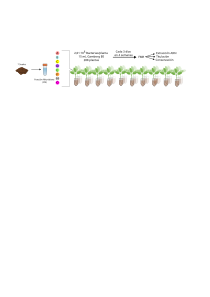

# Tesis doctoral
Este repositorio recoge los scripts desarrollados para la tesis doctoral: "Dinámica de ensamblaje del microbioma rizosférico del tomate".
----------

## Descripción de las carpetas

**Scripts Comunes**
En esta carpeta se encuentran los scripts utilizados en todos los capítulos. 

**Archivos Temporal**
En esta carpeta se encuentran los metadatos y el script (tanto en formato _.Rmd_ como _.html_) utilizado para el análisis de los datos.

**Archivos Deriva**
En esta carpeta se encuentran los metadatos y el script (tanto en formato _.Rmd_ como _.html_) utilizado para el análisis de los datos.

**Archivos Coalescencia**
En esta carpeta se encuentran los metadatos y el script (tanto en formato _.Rmd_ como _.html_) utilizado para el análisis de los datos.

**Archivos Transmisión**
En esta carpeta se encuentran los metadatos y el script (tanto en formato _.Rmd_ como _.html_) utilizado para el análisis de los datos.

